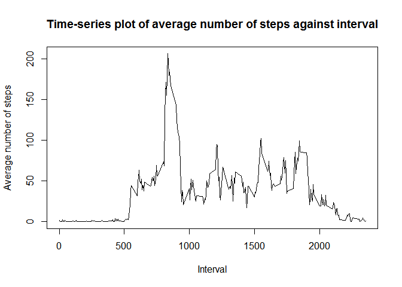

# Reproducible Research: Peer Assessment 1

## Data source

The data set was downloaded from the provided [Activity Monitoring Data URL](https://d396qusza40orc.cloudfront.net/repdata%2Fdata%2Factivity.zip) on 9 Apr 2015. The downloaded zip file was then uncompressed to obtain the data file, `activity.csv` which was subsequently used in this assignment.

## Library dependencies

The following libraries were loaded for this assignment.


```r
library(reshape2)
library(lattice)
```

## Loading and preprocessing the data

The activity dataset was first loaded into the data frame `activity`.


```r
activity = read.csv("activity.csv")
```

The date variable is initially read in as a factor type and it needed to be converted to a date type from the input format of "YYYY-MM-DD".


```r
activity$date = as.Date(activity$date, format="%Y-%m-%d")
```

## What is mean total number of steps taken per day?

The total number of steps taken each day, ignoring NA values, is computed into `totalStepsByDay`.


```r
totalStepsByDay = tapply(activity$steps, activity$date, sum, na.rm=T)
```

A histogram of the total number of steps taken each day is shown below.


```r
hist(totalStepsByDay,
     main = "Histogram of total number of steps each day",
     xlab = "Total number of steps each day")
```

 

The mean and median of the total number of steps taken each day is calculated using the following code chunk.


```r
totalStepsByDay.mean = mean(totalStepsByDay)
totalStepsByDay.median = median(totalStepsByDay)
```

The mean of the total number of steps taken each day is **9354.2295082** while its median is **10395**.

## What is the average daily activity pattern?

The average number of steps across all days for each interval, ignoring NA values, is computed into `avgStepsByInterval`.


```r
avgStepsByInterval = tapply(activity$steps, activity$interval, mean, na.rm=T)
```

The time-series plot of the average number of steps across all days against the interval measured is shown below.


```r
plot(as.numeric(names(avgStepsByInterval)),
     avgStepsByInterval,
     type = "l",
     main = "Time-series plot of average number of steps against interval",
     xlab = "Interval",
     ylab = "Average number of steps")
```

 

The interval containing the maximum number of steps is computed by the following code snippet.


```r
avgStepsByInterval.maxInterval = names(which.max(avgStepsByInterval))
```

The 5-minute interval containing the maximum number of steps is **835**.

## Imputing missing values

The total number of rows with missing values is computed below.


```r
activity.missingRows = !complete.cases(activity)
activity.numMissingRows = sum(activity.missingRows)
```

The total number of rows with missing values is **2304**.

The strategy for imputing the missing values is to use the median number of steps over all days with valid number of steps for that particular interval. This is implemented as below, and a new data frame, `imputedActivity` is created, such that it is equal to the original data set, `activity`, but with missing data filled in.


```r
# Compute median number of steps over all days with valid number of steps for each interval
medStepsByInterval = tapply(activity$steps, activity$interval, median, na.rm=T)
# Impute the missing values using the median
missingActivity = subset(activity, activity.missingRows)
imputedActivity = activity
imputedActivity[activity.missingRows,]$steps =
    sapply(missingActivity$interval,
           function(x) medStepsByInterval[[toString(x)]])
```

The histogram of the total number of steps taken each day, after imputing is done, is shown below.


```r
imputedActivity.totalStepsByDay = tapply(imputedActivity$steps,
                                         imputedActivity$date,
                                         sum)
hist(imputedActivity.totalStepsByDay,
     main = "Histogram of total number of steps each day (imputed)",
     xlab = "Total number of steps each day")
```

 

The mean and median of the total number of steps taken each day, after imputing, is computed using the following code snippet.


```r
imputedActivity.totalStepsByDay.mean = mean(imputedActivity.totalStepsByDay)
imputedActivity.totalStepsByDay.median = median(imputedActivity.totalStepsByDay)
```

The mean of the total number of steps taken each day, after imputing, is **9503.8688525** while its median is **10395**. The mean is larger than before, while the median stays the same.

This imputation procedure has the effect of increasing the estimated total daily number of steps per day, since missing values are treated as some postive number instead of just being ignored, i.e., taken as 0.

## Are there differences in activity patterns between weekdays and weekends?

A new factor variable `dayOfWeek` is added to the `imputedActivity` data frame to indicate weekday or weekend. This factor variable has two levels, `weekday` and `weekend`.


```r
# FALSE = "weekday", TRUE = "weekend"
imputedActivity$dayOfWeek = factor(weekdays(imputedActivity$date) %in%
                                       c("Saturday", "Sunday"),
                                   labels=c("weekday", "weekend"))
```

To produce the panel plot, the average number of steps for each interval is separately computed over all weekday days and weekend days. This is done using the code below.


```r
# Melt imputed activity data frame into long format,
# with steps being the value variable
ial = melt(imputedActivity,
           id.vars=c("date", "interval", "dayOfWeek"))
# Cast it back into data-frame, but averaging steps over date,
# for each interval and dayOfWeek
avgImputedActivity = dcast(ial,
                           interval + dayOfWeek ~ variable,
                           fun.aggregate = mean)
```

The panel plot below shows the time-series trend of the average number of steps vs interval for weekday and weekend.


```r
# Use the lattice plotting system for the panel plots
with(avgImputedActivity,
     xyplot(steps ~ interval | dayOfWeek,
            type = "l",
            layout = c(1,2),
            main = paste("Time-series plot of average number of steps vs interval",
                         "(over weekday days or weekend days)",
                         sep="\n"),
            xlab = "Interval",
            ylab = "Number of steps")
     )
```

 
